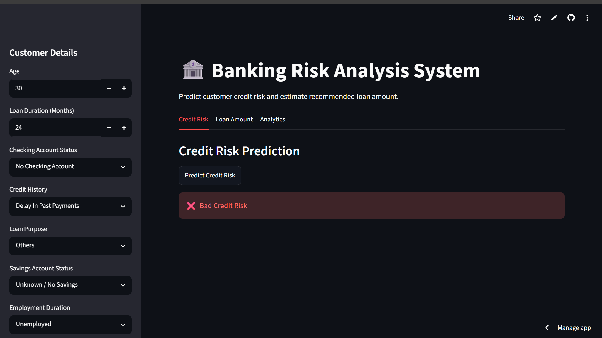
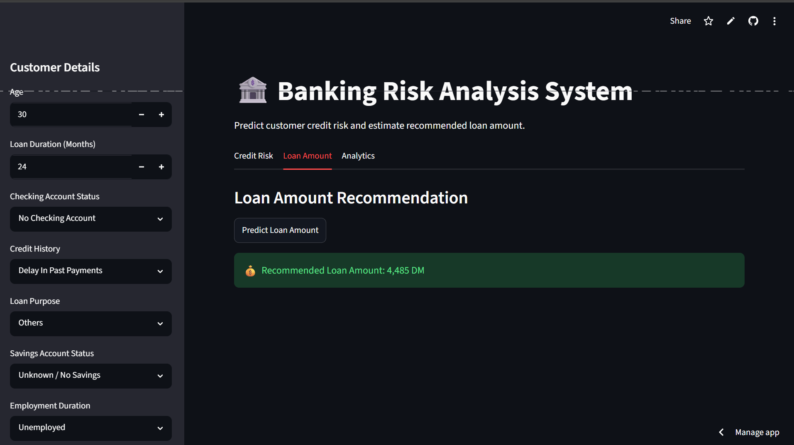
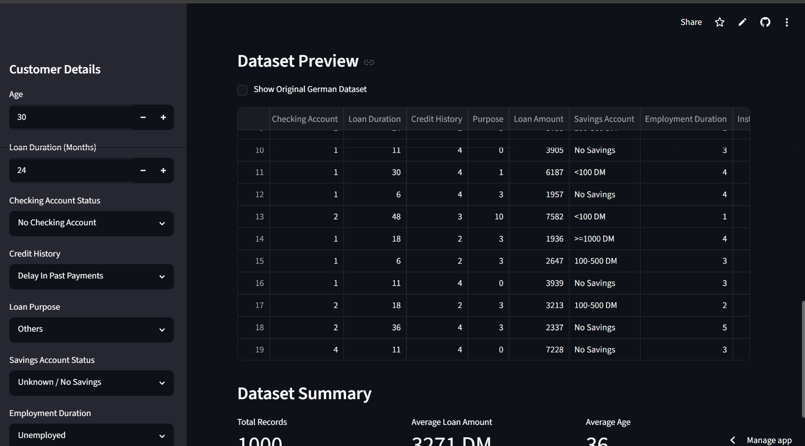

# 🏦 Banking Risk Analysis – Credit Risk Prediction & Loan Recommendation System

A Machine Learning-powered banking analytics platform that predicts customer credit risk and recommends loan amounts using the German Credit Dataset.

This project demonstrates the practical application of:

- Logistic Regression for Credit Risk Classification
- Linear Regression for Loan Amount Prediction
- Streamlit for Interactive Web Deployment
- Data Analysis & Visualization
- End-to-End ML Workflow

---
## Live Demo

🔗 https://banking-risk-analysis-system.streamlit.app/

## 📌 Features

### Credit Risk Prediction
Predicts whether a customer is:

- ✅ Good Credit Risk
- ❌ Bad Credit Risk

using Logistic Regression trained on historical banking data.

### Loan Amount Recommendation
Predicts a suitable loan amount based on customer financial information using Linear Regression.

### Interactive Dashboard
User-friendly Streamlit interface with:

- Customer information form
- Risk prediction
- Loan recommendation
- Dataset analytics
- Visual insights

### Analytics Module

Includes:

- Credit Risk Distribution
- Loan Amount Distribution
- Dataset Preview
- Summary Statistics

---

## 🧠 Machine Learning Models

### 1. Logistic Regression

Used for:

```text
Credit Risk Classification
```

Target Variable:

```text
kredit
```

Output:

```text
0 → Bad Credit Risk
1 → Good Credit Risk
```

---

### 2. Linear Regression

Used for:

```text
Loan Amount Prediction
```

Target Variable:

```text
hoehe
```

Output:

```text
Recommended Loan Amount
```

---

## 📂 Project Structure

```text
Banking-Risk-Analysis/
│
├── dataset/
│   └── german_credit_data.csv
│
├── models/
│   ├── risk_model.pkl
│   └── loan_model.pkl
│
├── screenshot/
│   ├── analytics-dashboard.png
│   └── credit-risk.png
│   └── loan-prediction.png
│
├── app.py
├── train_models.py
├── requirements.txt
├── .gitignore
└── README.md
```

---

## 📊 Dataset

Dataset Used:

**German Credit Dataset**

Contains customer information such as:

- Checking Account Status
- Credit History
- Loan Purpose
- Savings Account Status
- Employment Duration
- Age
- Housing Status
- Existing Credits
- Job Type
- Foreign Worker Status

Target Variables:

```text
kredit → Credit Risk
hoehe   → Loan Amount
```

---

## ⚙️ Technologies Used

### Programming Language

- Python

### Libraries

- Pandas
- NumPy
- Scikit-Learn
- Joblib
- Matplotlib
- Streamlit

---

## 🚀 Installation

### 1. Clone Repository

```bash
git clone https://github.com/yourusername/bankrisk-ai.git

cd banking-risk-analysis
```

### 2. Create Virtual Environment

Windows:

```bash
python -m venv venv
```

Activate:

```bash
venv\Scripts\activate
```

Mac/Linux:

```bash
python3 -m venv venv

source venv/bin/activate
```

---

### 3. Install Dependencies

```bash
pip install -r requirements.txt
```

---

## 🏋️ Train Models

Run:

```bash
python train_models.py
```

Output:

```text
models/
├── risk_model.pkl
└── loan_model.pkl
```

Example:

```text
Risk Model Accuracy: 0.76

Loan Model MAE: 1100.45

Models Saved Successfully
```

---

## ▶️ Run Application

```bash
streamlit run app.py
```

Application opens automatically at:

```text
http://localhost:8501
```

---

## 📈 Input Features

The application uses the following banking features:

| Feature | Description |
|----------|------------|
| laufkont | Checking Account Status |
| laufzeit | Loan Duration |
| moral | Credit History |
| verw | Loan Purpose |
| sparkont | Savings Account |
| beszeit | Employment Duration |
| rate | Installment Rate |
| famges | Personal Status |
| buerge | Other Debtors |
| wohnzeit | Residence Duration |
| verm | Property |
| alter | Age |
| weitkred | Other Installment Plans |
| wohn | Housing Status |
| bishkred | Existing Credits |
| beruf | Job Type |
| pers | People Liable |
| telef | Telephone |
| gastarb | Foreign Worker |

---

## 📊 Visualizations

The Analytics Dashboard provides:

### Credit Risk Distribution

Shows:

- Good Risk Customers
- Bad Risk Customers

### Loan Amount Distribution

Displays:

- Frequency of loan amounts
- Customer borrowing patterns

### Dataset Preview

Displays:

- Human-readable English labels
- Original German dataset option

---

## 💡 Business Applications

This system can be used by:

### Banks

- Loan Approval Assistance
- Creditworthiness Assessment
- Customer Risk Evaluation

### Financial Institutions

- Risk Management
- Lending Decisions
- Customer Segmentation

### FinTech Companies

- Credit Scoring Systems
- Loan Recommendation Engines
- Automated Financial Analysis

---

## 📷 Application Screenshots

### Credit Risk Prediction



---

### Loan Amount Recommendation



---

### Analytics Dashboard




### Credit Risk Prediction

```text
Input Customer Details
       ↓
Predict Credit Risk
       ↓
Good Risk / Bad Risk
```

### Loan Recommendation

```text
Input Customer Details
       ↓
Predict Loan Amount
       ↓
Recommended Loan Amount
```

### Analytics Dashboard

```text
Risk Distribution
Loan Distribution
Dataset Summary
```

---

## 🎯 Future Improvements

- Random Forest Classifier
- XGBoost Models
- SHAP Explainability
- PDF Report Generation
- Loan Approval Prediction
- Customer Segmentation
- Cloud Deployment
- Real-Time API Integration

---

## 📚 Learning Outcomes

Through this project, I gained experience in:

- Data Preprocessing
- Feature Engineering
- Logistic Regression
- Linear Regression
- Model Evaluation
- Streamlit Deployment
- Data Visualization
- End-to-End Machine Learning Development

---

## 👨‍💻 Author

**Ankit Kumar**

Pre-Final Year Computer Science Student

Interested in:

- Machine Learning
- Full Stack Development
- Data Science
- Artificial Intelligence

---

## ⭐ If you found this project useful, consider giving it a star!